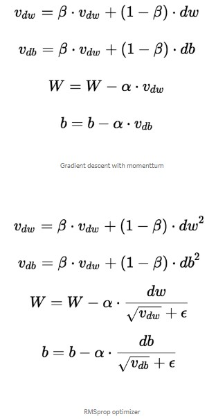
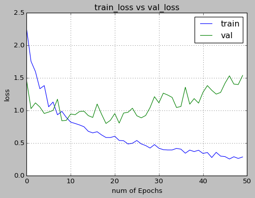
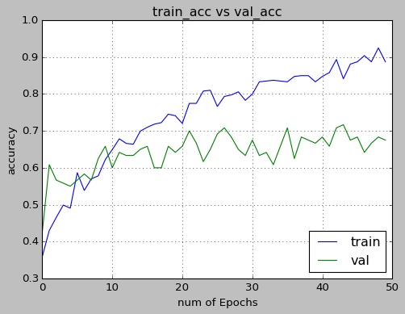

# 3D-CNN-for-action-recognition
This is a simulation of "3D CNN for Human action recognotion" by Shuiwang Ji, Wei Xu, Ming Yang

# Dataset
* kth dataset link: https://www.csc.kth.se/cvap/actions/
* KTH dataset has 6 classes of action namely handclapping,jogging,running,walking,handwaving and boxing
* Each class has 100 videos except one class has 99 videos
* To run ipynb file open google colab 
* create this path in your google drive  "dataset/kth dataset" for storing the dataset

# 3D CNN architecture
Applied the 3D convolution operation to extract spatial and temporal features from video data for action recognition
* 9  frames from each video are extracted 
* 5 channels from these 9 frames are applied
* Channels are:
 	 i)  grayscale    - 9
   ii) gradient x  - 9
   iii) gradient y - 9
   iv) optflow x -  8
   v) optflow y  -  8
* total of 43 frames for input in 3D CNN model
* 3 Conv layers and 2 maxpool layers are applied
* first layer is conv with kernel size 9X7X3 followed by 3X3X1 maxpool
* second layer is conv with kernel size 7X7X3 followed by 3X3X1 maxpool
* third is conv with kernel size 6X4X1 followed by a dense layer 
* relu is used as activation function for all layers except final layer in which softmax is used
* data is classified in 6 classes given in KTH dataset

# RMSprop Optimizer
The RMSprop optimizer is similar to the gradient descent algorithm with momentum. The RMSprop optimizer restricts the oscillations in the vertical direction. Therefore, we can increase our learning rate and our algorithm could take larger steps in the horizontal direction converging faster. The difference between RMSprop and gradient descent is on how the gradients are calculated. The following equations show how the gradients are calculated for the RMSprop and gradient descent with momentum.

# RESULS
Following results were obtained after training and testing the model on KTH dataset with the split of 0.8 and 0.2 respectively.
# Loss Graph

# Accuracy Graph

# Conclusion
* accuracy for training data was about 92% and for validation was about 70%
* Dropout of 50% and Batch Normalization for each layer decreased overfitting
* Hardwiring the input to 5 channels improved the accuracy significantly
